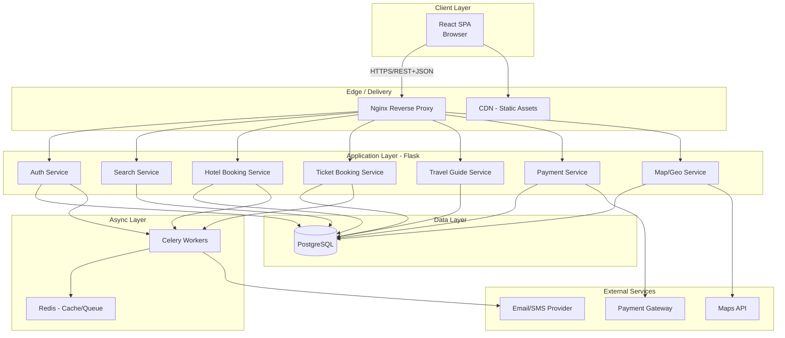
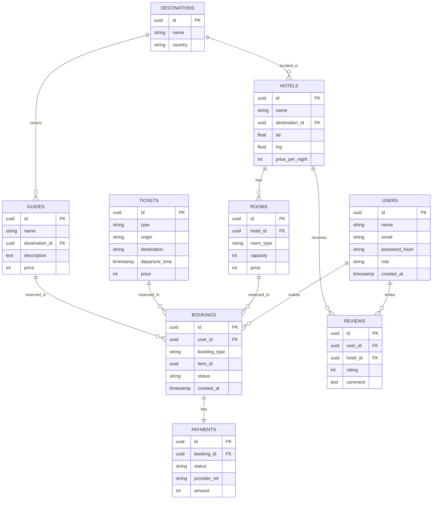

# Travel Website — Technical Architecture

**Project:** Travel Booking Platform
**Stack:** React (Frontend) · Python Flask (Backend) · PostgreSQL (Database)

---

## 2.1 High-Level Architecture



## 2.2 Frontend Architecture

```
src/
├── pages/            # Home, Login, Search, HotelDetails, Booking, About, Contact, Guide
├── components/        # Navbar, Footer, SearchBar, HotelCard, MapView, BookingForm
├── features/          # Redux slices: auth, search, booking, guide
├── services/          # api.js (Axios instance), authService, bookingService
├── hooks/             # useAuth, useDebounce, useGeolocation
├── routes/            # ProtectedRoute, AppRouter
├── context/           # AuthContext (if not using Redux)
└── utils/             # validators, formatters, constants
```

- **Routing:** Public routes (Home, About, Contact, Search) vs. Protected routes (Booking, Profile) guarded via `ProtectedRoute` checking JWT validity.
- **API layer:** Centralized Axios instance with request interceptor (attach JWT) and response interceptor (handle 401 → refresh token flow).
- **State:** Auth state, search filters/results, and active booking flow held in Redux; UI-local state (modals, form inputs) in component state.

## 2.3 Backend Architecture

```
app/
├── auth/              # /register /login /refresh /logout
├── search/            # /search/hotels /search/tickets /search/guides
├── hotels/            # /hotels /hotels/<id> /hotels/<id>/book
├── tickets/           # /tickets /tickets/<id>/book
├── guides/            # /guides /guides/<id>/book
├── bookings/          # /bookings (user booking history)
├── payments/          # /payments/checkout /payments/webhook
├── maps/              # /maps/geocode /maps/nearby
├── models/            # SQLAlchemy models
├── schemas/           # Marshmallow schemas
├── services/          # Business logic (kept out of routes)
└── extensions.py      # db, jwt, cors, limiter init
```

**Pattern:** Route (controller) → Service (business logic) → Model (data access). Keeps routes thin and logic testable/reusable.

## 2.4 Database Schema (Simplified ER Diagram)



## 2.5 Core REST API Endpoints

| Method | Endpoint | Description | Auth |
|---|---|---|---|
| POST | `/api/auth/register` | Create account | No |
| POST | `/api/auth/login` | Login, returns JWT pair | No |
| POST | `/api/auth/refresh` | Refresh access token | Refresh token |
| GET | `/api/search?type=hotel&location=&dates=` | Unified search | No |
| GET | `/api/hotels/:id` | Hotel details | No |
| POST | `/api/hotels/:id/book` | Book a hotel | Yes |
| GET | `/api/tickets?from=&to=&date=` | Search tickets | No |
| POST | `/api/tickets/:id/book` | Book a ticket | Yes |
| GET | `/api/guides?destination=` | List travel guides | No |
| POST | `/api/guides/:id/book` | Book a guide | Yes |
| GET | `/api/bookings/me` | User's booking history | Yes |
| POST | `/api/payments/checkout` | Initiate payment | Yes |
| POST | `/api/payments/webhook` | Payment provider callback | Signed webhook |
| GET | `/api/maps/nearby?lat=&lng=` | Nearby hotels/attractions | No |
| POST | `/api/contact` | Contact form submission | No |

---

## 2.6 Animation & Motion Design

**Style:** Smooth & modern — purposeful transitions and subtle parallax, not decorative noise. Motion should communicate *state change* (page loaded, item selected, step completed), never just "look nice."
**Library:** Framer Motion (`framer-motion`) — declarative, integrates cleanly with React Router, handles enter/exit animations via `AnimatePresence`, and is GPU-accelerated (animates `transform`/`opacity`, not layout properties).

### Motion Tokens (shared config)
```js
// src/motion/tokens.js
export const EASE = [0.22, 1, 0.36, 1]; // smooth "ease-out expo" feel
export const DURATION = { fast: 0.2, base: 0.35, slow: 0.6 };

export const fadeUp = {
  hidden: { opacity: 0, y: 16 },
  visible: { opacity: 1, y: 0, transition: { duration: DURATION.base, ease: EASE } },
};

export const staggerContainer = {
  visible: { transition: { staggerChildren: 0.08 } },
};
```

### Page Transitions (Route Changes)
```jsx
// src/routes/AppRouter.jsx
<AnimatePresence mode="wait">
  <Routes location={location} key={location.pathname}>
    ...
  </Routes>
</AnimatePresence>

// each Page component wraps its content:
<motion.div variants={fadeUp} initial="hidden" animate="visible" exit={{ opacity: 0 }}>
  {children}
</motion.div>
```
- **Home:** subtle **parallax** on the hero image/banner (background moves slower than foreground on scroll — `useScroll` + `useTransform` from Framer Motion).

### Search & Results
- **Search button:** scale-down micro-interaction on click (`whileTap={{ scale: 0.96 }}`) for tactile feedback.
- **Loading state:** animated skeleton cards (pulsing opacity) instead of a spinner — keeps layout stable while data loads.
- **Results reveal:** result cards fade/slide in with `staggerContainer`, each card ~80ms after the previous.

### Map Interactions
- **Pin drop:** markers animate in with a small bounce/scale-up when results load (staggered per pin, capped at ~150ms total delay).
- **Zoom/pan:** rely on the native Google Maps/Mapbox easing for camera moves.
- **Marker → info card:** clicking a pin animates an info card sliding up from the marker position rather than an abrupt popup.

### Booking Flow
- **Multi-step form:** each step slides horizontally (`x: 40 → 0` on enter, `x: -40` on exit) with a progress bar that animates width smoothly between steps.
- **Payment submit:** button morphs into a loading spinner state in place (no layout jump), then to a success checkmark.
- **Booking confirmation:** a brief checkmark/confetti-style reveal (~600ms) — confirms success without feeling gimmicky.

### Accessibility
```js
const shouldReduceMotion = useReducedMotion();
const transition = shouldReduceMotion ? { duration: 0 } : { duration: DURATION.base, ease: EASE };
```

### Performance Guidelines
- Animate only `transform` and `opacity` — never `width`/`height`/`top`/`left` (forces layout reflow).
- Cap simultaneous animated elements (e.g., stagger, don't animate 50 cards at once).
- Lazy-mount off-screen sections so their enter animation triggers only when scrolled into view (`whileInView`).

---

## Notes / Assumptions Made
- Assumed JWT-based auth (industry standard for React + Flask SPAs) rather than server-side sessions.
- Assumed PostgreSQL hosted as managed service (e.g., AWS RDS) for backups/HA, adjust if self-hosted.
- Booking flow assumes payment is captured before final confirmation (standard for travel bookings); can be changed to "reserve now, pay later" if that fits your business model better.
