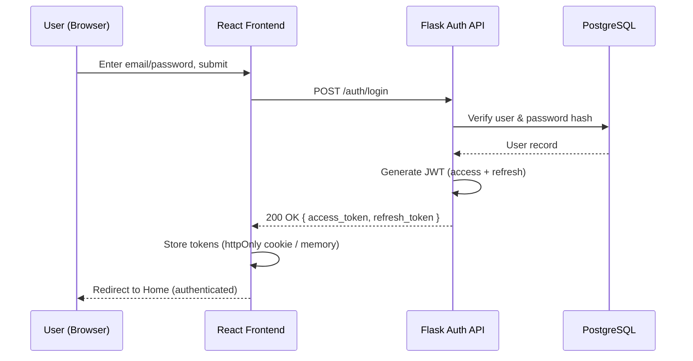
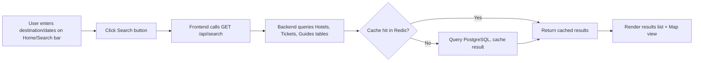
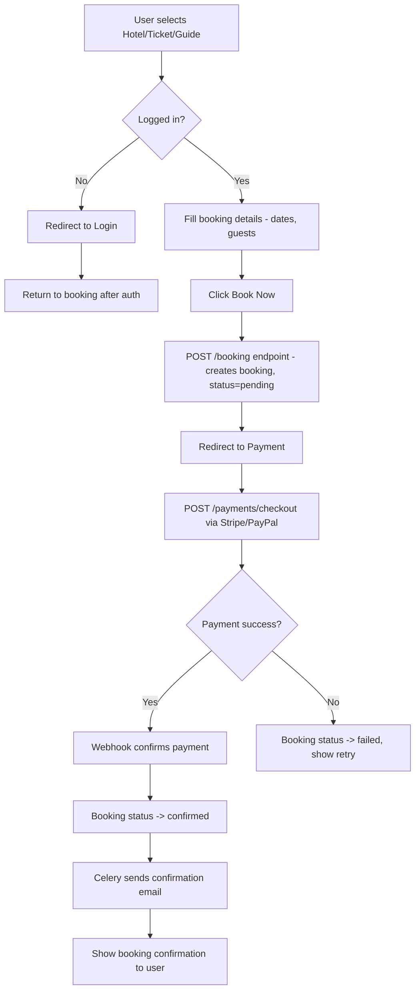
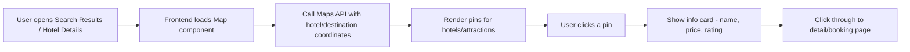
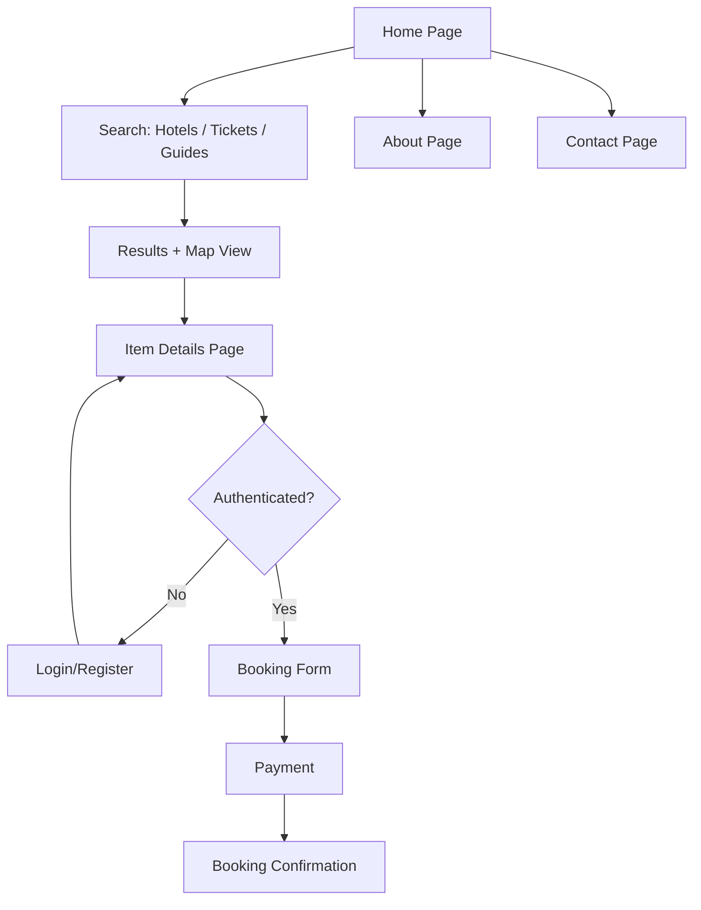

# Travel Website — System Workflow

**Project:** Travel Booking Platform

---

## 3.1 Registration & Login Flow

## 3.2 Search Flow

## 3.3 Hotel / Ticket / Guide Booking Flow

## 3.4 Map Interaction Flow

## 3.5 Overall User Journey

