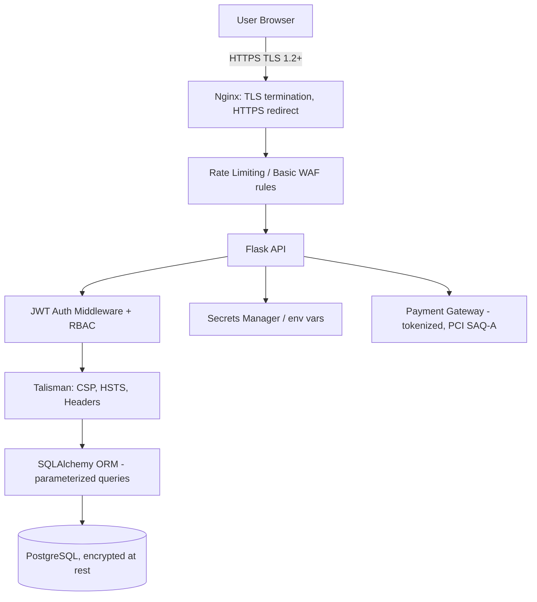

# Travel Website — Security Architecture

**Project:** Travel Booking Platform

---

## 4.1 Authentication & Session Management
- **Password storage:** bcrypt/Argon2 hashing with per-user salt — never store plaintext.
- **Tokens:** Short-lived JWT **access tokens** (~15 min) + long-lived **refresh tokens** (~7 days), refresh token stored in an `httpOnly`, `Secure`, `SameSite=Strict` cookie; access token kept in memory (not localStorage, to reduce XSS token theft risk).
- **Token rotation:** Refresh tokens rotated on use; old ones invalidated (stored/blacklisted in Redis).
- **Optional:** OAuth 2.0 (Google/Facebook login) as an additional login method.

## 4.2 Authorization
- **Role-Based Access Control (RBAC):** Roles — `guest`, `user`, `guide_partner`, `admin`.
- Protected endpoints (`/bookings`, `/payments`) enforced via a `@jwt_required` + role-check decorator at the Flask route level, not just hidden in the UI.

## 4.3 Data Protection
- **In transit:** TLS 1.2+/HTTPS enforced everywhere; HTTP → HTTPS redirect at Nginx.
- **At rest:** Sensitive columns (if any PII beyond normal profile data) encrypted at the DB or application layer; PostgreSQL disk encryption enabled at the hosting layer.
- **Payments:** No raw card data touches your servers — handled via Stripe/PayPal hosted fields or tokenized checkout (PCI-DSS SAQ-A scope only).

## 4.4 Input Validation & Injection Prevention
- All request payloads validated via **Marshmallow schemas** before hitting business logic.
- **SQL Injection:** Prevented structurally by using SQLAlchemy ORM with parameterized queries — no raw string-built SQL.
- **XSS:** React escapes rendered content by default; additionally sanitize any user-generated content (reviews, contact messages) and set a strict **Content-Security-Policy** header via Flask-Talisman.
- **CSRF:** SameSite cookies + CSRF tokens for any cookie-based state-changing requests.

## 4.5 Network & Infrastructure Security
- **Rate limiting:** Flask-Limiter on auth endpoints (e.g., 5 login attempts/min/IP) to mitigate brute force and credential stuffing.
- **Security headers:** Flask-Talisman applies HSTS, X-Frame-Options (clickjacking), X-Content-Type-Options, and CSP.
- **CORS:** Explicit allow-list of the frontend origin only — not wildcard `*`.
- **Secrets management:** DB credentials, JWT secret, API keys stored in environment variables / a secrets manager (AWS Secrets Manager, Vault) — never committed to source control.

## 4.6 Monitoring & Auditing
- Centralized error tracking (Sentry) and access logs.
- Audit trail table for sensitive actions: login attempts, booking changes, payment events.
- Automated dependency vulnerability scanning (GitHub Dependabot / `pip-audit` / `npm audit`) in CI.

## 4.7 Security Architecture Diagram

